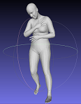
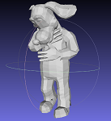
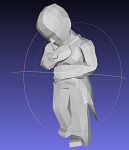

# Pose2Carton 

EE228 课程大作业，利用3D骨架控制3D卡通人物。

# Maya 环境配置

这里请简单描述你配置Maya环境的过程。

# 匹配流程

这里请简单描述你熟悉/使用 匹配代码的流程，可以简述对代码的理解/各个函数作用等。

# 新增脚本说明

如果你写了自己的脚本来处理数据或进行可视化，请在这里进行相关说明(如何使用等)； 如果没有，请忽略该模块。

# 项目结果

这里放置来自你最终匹配结果的截图， 如

# 协议 
本项目在 Apache-2.0 协议下开源

所涉及代码及数据的最终解释权归倪冰冰老师课题组所有

Group 33, 34
